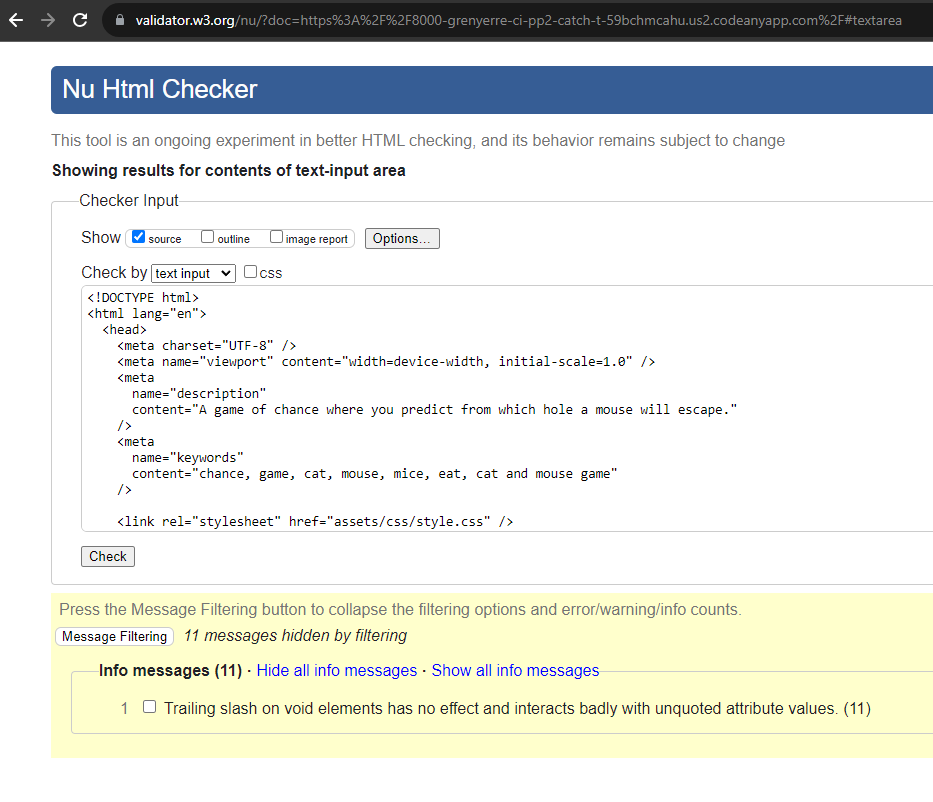

# **Catch The Mousie! - Code Institute Portfolio Project 2**

Welcome to 'Catch The Mousie!', a game of chance where the player attempts to feed a hungry cat.
To do this, they must predict from which hole a mouse will appear and direct the cat to the same hole.

Project Aim: Construct an interactive front-end application which responds to the user's actions. The site will alter the information it displays depending on the user's actions.

.

[Live link to website](https://grenyerre.github.io/CI-PP2-Catch-The-Mousie/)

## **User Experience (UX) & Design**

The website was initially a single-serving site (SSS), however I added a welcome screen to ensure the player had access to the instructions before gameplay began. My final design is simple and prioritizes the game play area. Neither the setting or control buttons interfere with the game play area.

### **User Stories**

- As a user/player, I would like to see the title of the application at the top of the display.
- As a user/player, I would like to be able to view game play instructions without having to open another tab/follow a link.
- As a user/player, I would like to be able to easily exit these instructions and return to the game play.
- As a user/player, I would like to toggle the playback of the music on and off.
- As a user/player, I would like the option of resetting the game at any point.
- As a user/player, I would like feedback on my recent play (whether I scored a point or not).
- As a user/player, I would like an ongoing update of my score.
- As a user/player, I would like to settings and control buttons to be easily visible and identifiable.
- As a user/player, I would like to know the name of the cat.

### **Wireframe**

The wireframe was created using Balsamiq.

### **Colour Choice**

The colour palette was created using [color.adobe.com](https://color.adobe.com/create/color-wheel).
Base colour: #D467F0
Colour harmony: Shades
As the images in the game play area are monochromatic, I wanted to utilize colours in the surrounding area. I wanted to have sufficient contrast between the settings and control buttons, and the background.

### **Font Choice**

The font is taken from [Google Fonts](https://fonts.google.com/). It is called Englebert.

## **Features**

### **Favicon**

The favicon was created using [favicon.io](https://favicon.io/favicon-converter/).
I used the image of the game's protagonist.

### **Settings Buttons**

These are located at the top centre of the display. They allow the user to view the instructions, toggle the music on and off, and reset the game.

- Upon clicking the 'INSTRUCTIONS' button, a modal appears containing written instructions of the game play. The modal can be closed by clicking the close button.
- Upon landing, the music is muted.
- Upon clicking the 'RESTART GAME' button, the page will reload and all current score information will be lost.

### **Game Play Area**

This is the largest section of the page and displays the images of the game's protagonist and antagonist. These images reflect the actions of the player and the computer choice. They also vary at the end of the game to reflect the cat's state of satiety.

### **Control Buttons**

These allow the player to input their choice of which hole they believe the mouse will appear; left, centre, or right.

### **Score Area**

Here is displayed in numbers how many mice have been caught (eaten!) and how many have escaped.

### **Game State Area**

Messages are displayed here to inform the player of the required action, the result of their actions, and the final score messages.

### **Footer**

Contains information regarding the copyright owner of the images and music used and the site's author.

## **Ideas In Development**

- Increase the number of holes from which the mouse can escape to five. Probability: 70%.
- To separate the music and sound effects so that they can be toggled on/off independently. Probability: 50%.
- Alter the game graphics to allow the user to choose the cat's colouring; black, tortoiseshell, ginger, grey. Probability: 10%.
- To include a high score table to record the highest scores, the date and the player name. Probability: 10%.

## **Software Used**

Below is a list of the software/applications used in the construction of this project.

- [HTML5](https://en.wikipedia.org/wiki/HTML5)
  - Used to create the structure of the webpage.
- [CSS3](https://en.wikipedia.org/wiki/CSS)
  - Used to style the content of the webpage.
- [JavaScript](https://en.wikipedia.org/wiki/JavaScript)
  - Used to implement functionality in the game.
- [GitHub](https://github.com/)
  - Used to store and manage the project's code.
- [Codeanywhere](https://app.codeanywhere.com/)
  - Used as the project's Independent Development Environment (IDE).
- [Google Chrome DevTools](https://developers.google.com/web/tools/chrome-devtools)
  - Used in the testing and debugging process.
- [W3C Markup Validation Service](https://validator.w3.org/)
  - Used to validate the project's HTML code.
- [W3C CSS Validation Service](https://jigsaw.w3.org/css-validator/)
  - Used to validate the project's CSS code.
- [JSHint](https:..jshint.com/)
  - Used to validate the project's JavaScript code.
- [MicroSoft Paint](https://microsoft.com > en-us > windows > paint)
  - Used to create the game's images.
- [Webaim.](https://webaim.org/resources/contrastchecker/)
  - Used to check colour scheme for readability.
- [Am I Responsive](https://ui.dev/amiresponsive)
  - Used to create an image of the various display sizes of the site.

## **Testing**

### Alternative Browsers

Once deployed, I tested the site using the following browsers; Google Chrome, Mozilla Firefox, Microsoft Edge, and Opera Software's Opera. Each browser loaded successfully and no issues were detected.

Google Chrome

Mozilla Firefox

Microsoft Edge

Opera Software Opera

### Software Validation Testing

The warnings issued on the HTML documents seem to be an aftereffect of Codeanywhere's IDE. I have attempted to remove the unnecessary slashes however they always return once reloaded.

index.html

"Section lacks heading" - I have been informed by my peers that it is best practice to use sections in this case.
"Empty heading" - I have been informed that the HTML still passes validation however it is is slight misuse of semantics.
game.html

style.css

Google Chrome DevTools Lighthouse

## **Debugging**

## **Deployment**

The site was deployed to GitHub pages.

## **Credits**

- I would like to credit a Code Institute alumni, Adam Gilroy, with the game layout upon which 'Catch The Mousie!' is based.
- I visited w3schools.com numerous times during this project's inception. The code for the modal is based upon this page; [w3schools css modal how to](https://w3schools.com/howto/howto_css_modals.asp/).
-

## **Acknowledgements**

I would like to thank my mentor(s), Luke Buchanan and Daisy McGirr (who stood in for Luke whilst on leave) for their guidance, understanding and support. I would also like to thank John and Martin from the Code Institute Tutoring Team for their assistance. Additionally, I would like to thank my wife Tracy for her consistent resilience, support, and encouragement.
